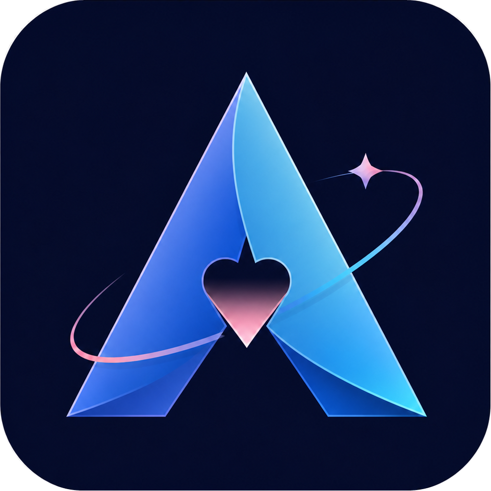

<div align="center">
  
  <h1>阿利宙斯阅读</h1>
  <p>简洁、本地优先的 Windows Markdown 与纯文本阅读器</p>

  
  
  
</div>

阿利宙斯阅读用于把本地资料文件夹变成清晰的树状阅读目录。它专注于 Markdown 和普通文本，不需要账号、不上传文档，也不引入复杂的知识库管理流程。

## 功能特点

- 支持 `.md`、`.markdown`、`.txt` 文件
- 选择一个或多个文件夹作为阅读节点，自动生成树状目录
- 文件夹使用展开 / 收起状态图标，单击整行即可切换
- 右键重命名文件或文件夹，自动校验重名、非法字符与扩展名
- 可拖动侧栏宽度，并自动记住调整结果
- 支持标题、列表、引用、代码、链接与 GFM 表格渲染
- Markdown 编辑模式：左侧源码，右侧实时预览
- 白天 / 暗黑主题切换
- 按阅读节点归组历史记录，自动恢复最近文档
- 记住阅读字号、侧栏宽度和主题
- 毛玻璃风格确认与输入弹窗
- 本地优先：阅读历史和设置只保存在本机

## 快速开始

### 环境要求

- Windows 10 / 11（x64）
- [.NET 10 SDK](https://dotnet.microsoft.com/download/dotnet/10.0)

### 从源码运行

```powershell
git clone https://github.com/1119264845/AlyzeusReader.git
cd AlyzeusReader
dotnet run
```

项目中的 `示例阅读库` 可用于快速体验 Markdown、子文件夹目录和纯文本阅读。

### 构建单文件 EXE

```powershell
.\build.ps1
```

构建产物位于 `dist/阿利宙斯阅读.exe`。它是自包含的 `win-x64` 单文件应用，目标电脑无需另行安装 .NET Runtime。

## 快捷键

| 快捷键 | 功能 |
| --- | --- |
| `Ctrl+O` | 选择阅读文件夹 |
| `Ctrl+S` | 保存正在编辑的 Markdown |
| `Ctrl+E` | 切换 Markdown 编辑模式 |
| `Ctrl++` / `Ctrl+-` | 增大 / 减小阅读字号 |
| `Ctrl+H` | 打开历史记录 |

## 项目结构

```text
├─ MainWindow.xaml(.cs)    主窗口、目录树与阅读交互
├─ GlassDialog.xaml(.cs)   毛玻璃弹窗
├─ MarkdownRenderer.cs     Markdown / 文本渲染
├─ Models.cs               阅读节点、历史记录与应用状态
├─ assets/                 应用图标资源
├─ 示例阅读库/             本地体验内容
└─ build.ps1               Windows 单文件发布脚本
```

## 数据与隐私

- 应用不会联网读取或上传文档。
- 历史记录、主题与界面设置保存在 `%LocalAppData%\JianRead`。
- 阅读模式不会修改原文件；只有主动保存编辑内容或执行重命名时才会写入磁盘。

## 参与贡献

欢迎提交 Issue 或 Pull Request。提交代码前请确保：

```powershell
dotnet build -c Release
```

可以正常通过。

## 开源许可

本项目使用 [MIT License](LICENSE)。
